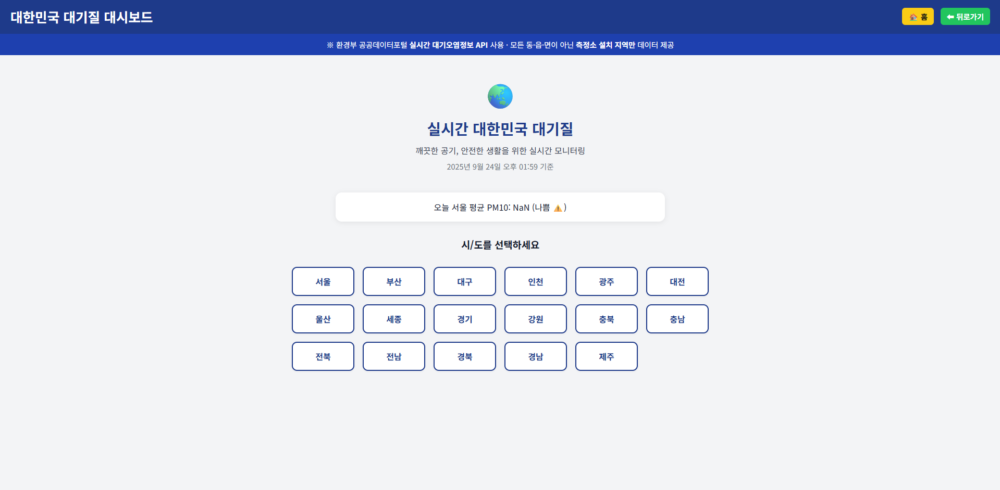
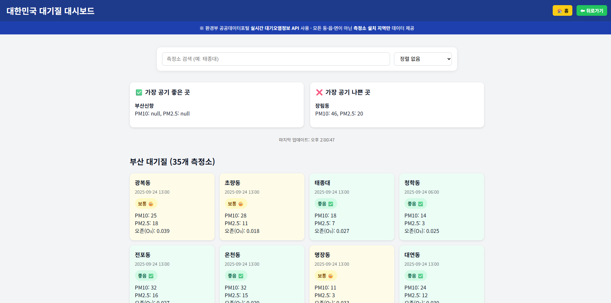
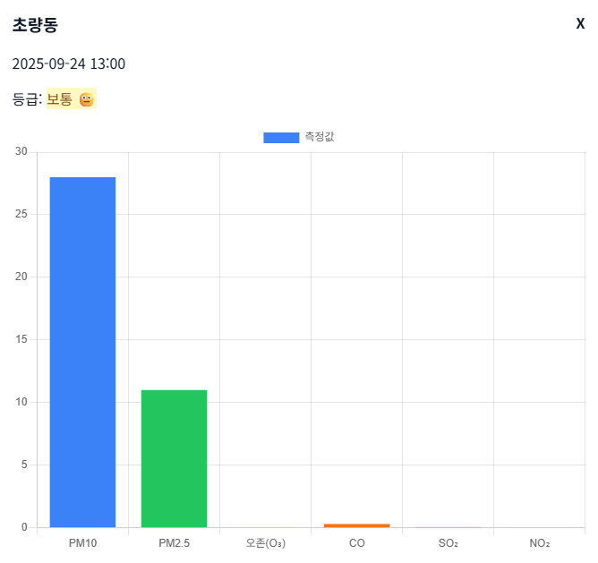
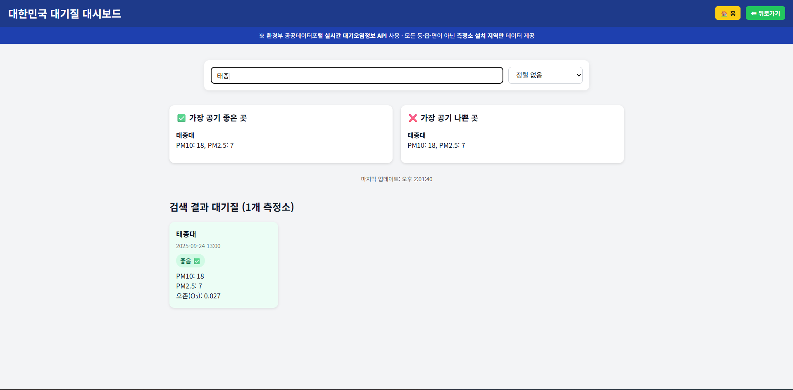

# 대한민국 대기질 대시보드

환경부 공공데이터포털의 **실시간 대기오염정보 API**를 이용해, 시/도를 선택하면 해당 지역의 측정소별 대기질을 카드/grid로 보여주는 단일 HTML 대시보드입니다. 검색·정렬·요약(가장 좋음/나쁨)·상세 모달(차트)·자동 새로고침까지 **모두 브라우저만으로 동작**합니다.

> ⚠️ 안내: 공공데이터는 **측정소가 설치된 지역**만 데이터가 있습니다(모든 동/읍/면 X).

---

## 미리보기 (Screenshots)


| 홈 화면 (Hero/요약/지역선택)                  | 지역 화면 (요약/카드 리스트)                        |
| ------------------------------------ | ---------------------------------------- |
|  |  |

| 상세 모달 (막대 차트)                          | 검색/정렬 박스                                     |
| -------------------------------------- | -------------------------------------------- |
|  |  |

---

## 핵심 기능 (Features)

* **시/도 선택 그리드**: 서울·부산·대구·…·제주 버튼을 클릭하여 데이터 조회
* **검색(Search)**: 측정소명 실시간 필터링 (예: `태종대`)
* **정렬(Sort)**: `PM10`, `PM2.5`, `O₃` 높은 순 정렬
* **요약 카드**: 선택한 시/도 내 *가장 공기 좋은 측정소* / *가장 나쁜 측정소* 강조
* **상세 모달(Chart.js)**: 카드 클릭 시 `PM10/PM2.5/O₃/CO/SO₂/NO₂` 막대 차트로 시각화
* **자동 새로고침**: 5분마다 현재 보고 있는 지역의 최신 데이터로 갱신
* **업데이트 시각 표시**: `마지막 업데이트: HH:MM:SS`
* **홈/뒤로가기 내비게이션**: 상단 우측 버튼으로 화면 전환
* **반응형 레이아웃**: 카드형 grid로 데스크톱/모바일 대응

---

## 기술 스택

* **Vanilla HTML/CSS/JS** (빌드/프레임워크 불필요)
* **Chart.js** (CDN) – 상세 모달 막대 차트
* **환경부 대기오염정보 API**

---

## 빠른 시작 (Quick Start)

1. 이 저장소(혹은 `index.html`)를 다운로드합니다.
2. 파일을 열어 아래 상수에 **본인 발급 서비스키**를 넣습니다.

   ```html
   <script>
   const SERVICE_KEY = "여기에_본인_서비스키"; // 반드시 URL 인코딩 권장
   </script>
   ```

   * 공공데이터포털에서 발급받은 **일반 인증키(Decoded)** 또는 **URL Encoded 키** 사용 가능
   * 안전을 위해 `encodeURIComponent(SERVICE_KEY)` 사용을 권장합니다.
3. 파일을 더블클릭해 브라우저로 열면 바로 동작합니다.

   * 또는 정적 호스팅(GitHub Pages/Netlify/Vercel)에 업로드해도 OK.

---

## 파일 구조 (권장)

```
.
├─ index.html                 # 단일 페이지 앱
└─ assets/
   └─ screenshots/            # README용 스크린샷 이미지
      ├─ home.png
      ├─ region.png
      ├─ modal.png
      └─ controls.png
```

---

## 설정 & 커스터마이징

### 1) 서비스 키 설정

* `index.html` 상단 스크립트에 상수로 지정되어 있습니다.
* URL에 키를 그대로 붙이기 전에, **반드시 인코딩**을 고려하세요:

  ```js
  const url = `https://apis.data.go.kr/B552584/ArpltnInforInqireSvc/getCtprvnRltmMesureDnsty?`+
              `serviceKey=${encodeURIComponent(SERVICE_KEY)}` +
              `&returnType=json&sidoName=${encodeURIComponent(sido)}` +
              `&numOfRows=100&pageNo=1&ver=1.0`;
  ```

### 2) 자동 새로고침 주기

* 기본 5분(300,000ms). 아래 구문에서 수정:

  ```js
  setInterval(()=>{ if(currentSido) loadData(currentSido); }, 300000);
  ```

### 3) 등급 색상/텍스트

* `gradeClass(grade)`에서 자유롭게 스타일/라벨 변경:

  ```js
  function gradeClass(grade){
    switch(grade){
      case "1": return {cls:"good", text:"좋음 ✅", bg:"good-bg"};
      case "2": return {cls:"normal", text:"보통 😐", bg:"normal-bg"};
      case "3": return {cls:"bad", text:"나쁨 ⚠️", bg:"bad-bg"};
      case "4": return {cls:"verybad", text:"매우나쁨 ❌", bg:"verybad-bg"};
      default:   return {cls:"", text:"-", bg:""};
    }
  }
  ```

### 4) 홈 화면 요약 박스(전국 대체)

* 샘플로 **서울 데이터 평균 PM10**을 전국 요약처럼 표시합니다. 필요시 다중 시/도 호출로 실제 전국 평균을 계산하도록 확장하세요.

---

## API 상세

* **엔드포인트**: `getCtprvnRltmMesureDnsty`

* **Base URL**: `https://apis.data.go.kr/B552584/ArpltnInforInqireSvc/getCtprvnRltmMesureDnsty`

* **주요 파라미터**

  | 파라미터         | 값/예시         | 설명         |
  | ------------ | ------------ | ---------- |
  | `serviceKey` | (본인키)        | URL 인코딩 권장 |
  | `returnType` | `json`       | JSON 응답    |
  | `sidoName`   | `서울`, `부산` 등 | 시/도 한글명    |
  | `numOfRows`  | `100`        | 최대 100 추천  |
  | `pageNo`     | `1`          | 페이지 번호     |
  | `ver`        | `1.0`        | API 버전     |

* **응답 필드(일부)**

  | 필드            | 예시                 | 설명                                  |
  | ------------- | ------------------ | ----------------------------------- |
  | `stationName` | `태종대`              | 측정소명                                |
  | `dataTime`    | `YYYY-MM-DD HH:00` | 측정시각                                |
  | `pm10Value`   | `18`               | 미세먼지(㎍/m³)                          |
  | `pm25Value`   | `7`                | 초미세먼지(㎍/m³)                         |
  | `o3Value`     | `0.027`            | 오존(ppm)                             |
  | `no2Value`    | `0.007`            | 이산화질소(ppm)                          |
  | `so2Value`    | `0.003`            | 아황산가스(ppm)                          |
  | `coValue`     | `0.2`              | 일산화탄소(ppm)                          |
  | `khaiGrade`   | `1~4`              | 통합대기환경등급 (1:좋음, 2:보통, 3:나쁨, 4:매우나쁨) |

* **예시 요청**

  ```
  GET https://apis.data.go.kr/B552584/ArpltnInforInqireSvc/getCtprvnRltmMesureDnsty?
      serviceKey=<인코딩된키>&returnType=json&sidoName=부산&numOfRows=100&pageNo=1&ver=1.0
  ```

---

## 동작 방식 (Flow)

1. 홈 화면에서 시/도 선택 → `loadData(sido)`
2. API 호출 → `items` 수신
3. 상단 요약(최저/최고 PM10) 계산 → 요약 카드 렌더링
4. 카드 그리드 렌더링 → 클릭 시 모달 열림
5. 모달에서 Chart.js 막대 그래프 생성
6. 5분마다 자동 새로고침 (현재 시/도 유지)

---

## 접근성/반응형

* 버튼/카드에 충분한 대비 색상과 hover 피드백 제공
* `grid-template-columns: repeat(auto-fill, minmax(...))`로 모바일\~데스크톱 자동 대응

---

## 문제 해결 가이드 (Troubleshooting)

* `SERVICE_KEY_IS_NOT_REGISTERED_ERROR`

  * 발급/승인 상태 확인, **URL 인코딩 여부 확인**
  * 키 복사 시 공백/개행 포함 여부 확인
* CORS/차단 이슈

  * 대체 네트워크/https 페이지에서 재시도
* 응답은 오는데 **빈 목록**

  * 해당 시/도에 *현재시각 기준* 데이터가 없거나 통신장애
  * 다른 시/도/시각으로 재시도
* JSON 파싱 오류

  * `returnType=json` 확인, 응답이 XML이면 키/파라미터 점검

---

## 로드맵 (선택 사항)

* 측정소 **최근 N시간 라인 차트** 추가 (추세)
* **즐겨찾기**(localStorage) 복구 옵션
* **현재 위치 기반** 자동 시/도 제안
* **카카오 지도** 연동한 지오피닝(마커)

---

## 라이선스

* 코드 예시: MIT (필요 시 변경)
* 데이터: 환경부 공공데이터포털 약관을 따릅니다.

---

## 감사

* 환경부 공공데이터포털
* Chart.js 팀

---

## 부록: 핵심 코드 스니펫

```html
<script>
const SERVICE_KEY = "여기에_본인_서비스키";

async function loadData(sido){
  const url = `https://apis.data.go.kr/B552584/ArpltnInforInqireSvc/getCtprvnRltmMesureDnsty?`+
              `serviceKey=${encodeURIComponent(SERVICE_KEY)}`+
              `&returnType=json&sidoName=${encodeURIComponent(sido)}&numOfRows=100&pageNo=1&ver=1.0`;
  const res = await fetch(url);
  const json = await res.json();
  const items = json.response.body.items;
  // TODO: renderItems(items, sido)
}
</script>
```

