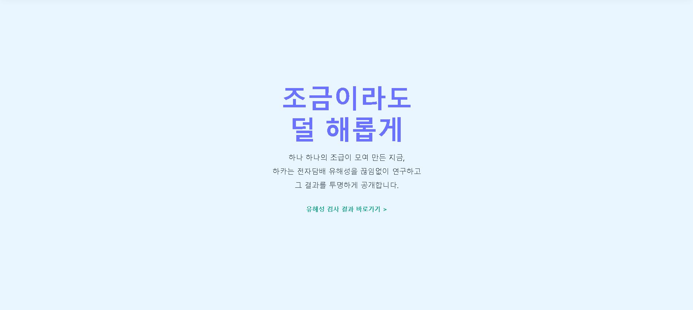
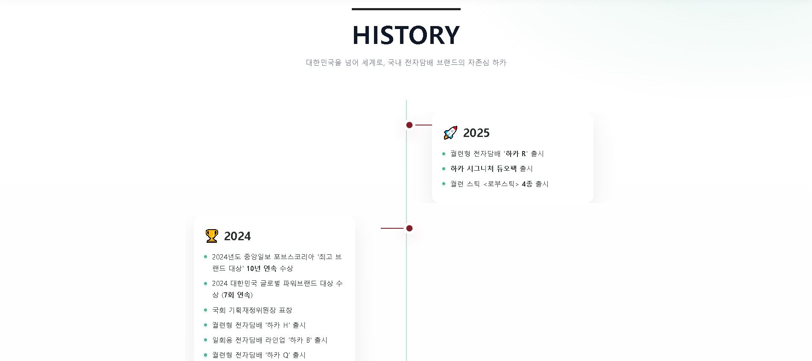
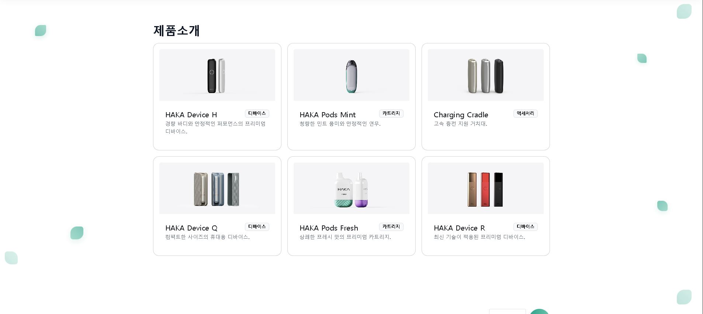
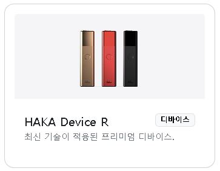
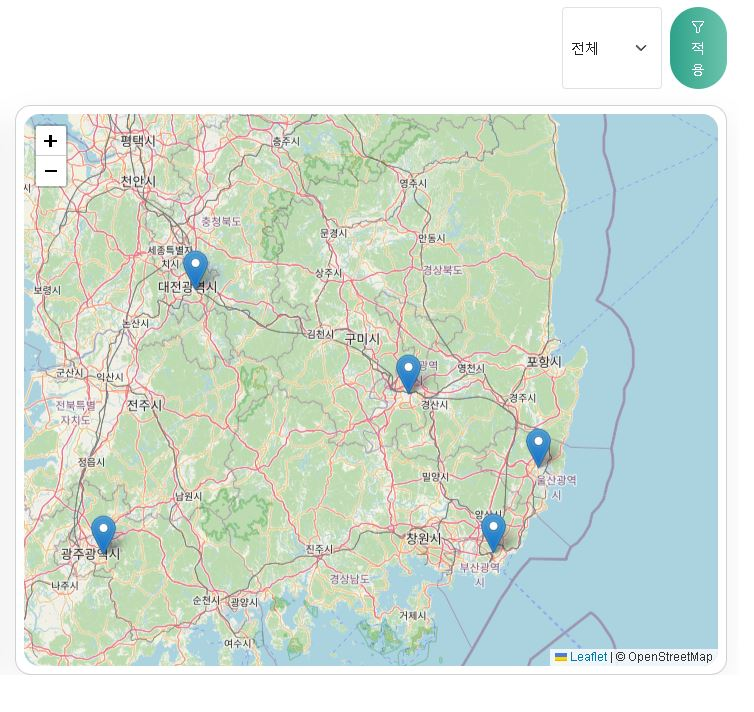
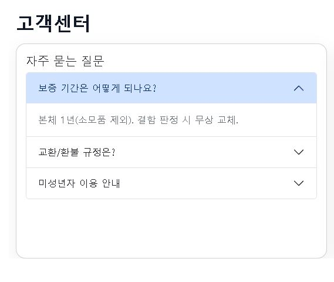
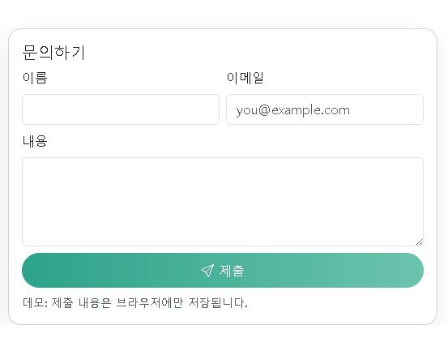

> **“Trust Your Judgment.”**
> 대한민국 전자담배 브랜드의 감성과 인터랙션을 담은 **하카 스타일 데모** 웹사이트.

---

## 목차

1. [프로젝트 개요](#프로젝트-개요)
2. [미리보기 & 스크린샷](#미리보기--스크린샷)
3. [주요 기능](#주요-기능)
4. [폴더 구조](#폴더-구조)
5. [데이터 포맷 (JSON 스키마)](#데이터-포맷-json-스키마)
6. [로컬 실행](#로컬-실행)
7. [GitHub Pages 배포](#github-pages-배포)
8. [커스터마이징 가이드](#커스터마이징-가이드)
9. [TODO](#todo)
10. [라이선스](#라이선스)

---

## 프로젝트 개요

* **목적**: 브랜드 소개(하카소개/히스토리), 제품 목록, 매장 지도, 고객센터를 하나의 페이지에서 제공하는 반응형 데모.
* **기술 스택**:

  * UI: Bootstrap 5, Bootstrap Icons
  * 지도: Leaflet.js
  * 언어/런타임: HTML, CSS, JavaScript(ES Modules)
* **핵심 파일**:

  * `index.html` – 메인 페이지 (모든 섹션이 여기 포함)
  * `styles.css` – 글래스모피즘, 히어로/타임라인 커스텀 스타일
  * `app.js` – 제품/매장 데이터 로딩, 지도/필터 초기화, 폼 데모 처리
  * `data/products.json` – 제품 데이터 소스
  * `data/branches.json` – 매장 데이터 소스

> ⚠️ **주의**: 본 리포지토리는 데모 콘텐츠이며, 고객센터 제출은 실제 서버로 전송되지 않고 **브라우저 저장(로컬)** 을 사용합니다.

---

## 미리보기 & 스크린샷

* 정보는 사실과 다를수있으며 교육용으로 개발된 사이트입니다!

### 0) 전체 미리보기


---

### 1) NAVBAR

> 로고 SVG + “하카소개/제품소개/매장찾기/고객센터” 네비게이션

| 이미지                                 | 설명                                 |
| ----------------------------------- | ---------------------------------- |
|  | 투명한 글래스 네비게이션, 스크롤 시 고정(Fixed-top) |

---

### 2) HERO 섹션 (유튜브 + 메시지)

> 유튜브 임베드(16:9)와 브랜드 슬로건, CTA 버튼

| 이미지                             | 설명                        |
| ------------------------------- | ------------------------- |
|  | YouTube iframe, 버튼(제품/매장) |

---

### 3) 하카소개 (Hero-1 ~ Hero-4)

> 브랜드 철학: 일상의 변화, 덜 해롭게, 인재, 앞으로

| Hero-1                               | Hero-2                               | Hero-3                               | Hero-4                               |
| ------------------------------------ | ------------------------------------ | ------------------------------------ | ------------------------------------ |
|  |  |  |  |

---

### 4) HISTORY (타임라인)

> 2015 ~ 2025 연혁. 좌/우 번갈아 박스형 타임라인.

| 이미지                                   | 설명                          |
| ------------------------------------- | --------------------------- |
|  | 연도 강조(2015~2025), 카드/리스트 항목 |

---

### 5) 제품소개 (Products)

> `products.json` 데이터 → 카드 그리드 자동 생성

| 전체 그리드                                  | 카드 확대                                           |
| --------------------------------------- | ----------------------------------------------- |
|  |  |

---

### 6) 매장찾기 (Stores)

> `branches.json` + Leaflet 지도. 좌측 리스트 / 우측 지도, 시/도 필터.

| 리스트                                          | 지도                                         |
| -------------------------------------------- | ------------------------------------------ |
|  |  |

---

### 7) 고객센터 (Support)

> FAQ 아코디언 + 문의하기 폼(데모).

| FAQ                                   | 문의 폼                                    |
| ------------------------------------- | --------------------------------------- |
|  |  |

---

### 8) FOOTER

> 섹션 앵커 링크, 카피라이트.

| 이미지                                 | 설명                      |
| ----------------------------------- | ----------------------- |
|  | 링크(TOP/제품/매장/고객센터), 저작권 |

---

## 주요 기능

* **반응형 레이아웃**: 모바일~데스크톱 자연 전환
* **SVG 로고/그라디언트**: 경량/선명 로고
* **타임라인 컴포넌트**: 좌/우 교차 배치, 연도 컬러 태그
* **제품 카드 자동 생성**: `products.json` 기반 렌더링 (카테고리/태그 확장 용이)
* **매장 지도**: Leaflet으로 마커 표시, 리스트 클릭 → 지도 이동
* **고객센터 폼(데모)**: 제출 내용 브라우저 저장(localStorage)

---

## 폴더 구조

```bash
.
├── index.html
├── styles.css
├── app.js
├── data/
│   ├── products.json
│   └── branches.json
├── images/
│   └── logo.png
└── screenshots/
    ├── overview.png
    ├── navbar.png
    ├── hero.png
    ├── intro-1.png
    ├── intro-2.png
    ├── intro-3.png
    ├── intro-4.png
    ├── history.png
    ├── products.png
    ├── product-card.png
    ├── stores-list.png
    ├── stores-map.png
    ├── support-faq.png
    ├── support-form.png
    └── footer.png
```

> 이름은 예시입니다. 파일명/경로만 맞추면 README가 자동으로 썸네일을 렌더링합니다.

---

## 데이터 포맷 (JSON 스키마)

### `data/products.json`

```json
[
  {
    "id": "p001",
    "name": "하카 R",
    "category": "heated",
    "desc": "신형 궐련형 디바이스",
    "price": 89000,
    "tags": ["new", "signature"],
    "image": "./images/products/haka-r.png"
  }
]
```

* **필드 설명**

  * `id`: 문자열, 유니크 ID
  * `name`: 제품명
  * `category`: 카테고리(예: `heated`, `pod`, `disposable` 등)
  * `desc`: 요약 설명
  * `price`: 숫자(정수)
  * `tags`: 문자열 배열(필터/뱃지 용도)
  * `image`: 이미지 경로(상대경로 권장)

### `data/branches.json`

```json
[
  {
    "id": "b001",
    "name": "하카 부산 서면점",
    "sido": "부산",
    "address": "부산광역시 부산진구 ...",
    "tel": "051-000-0000",
    "lat": 35.157,
    "lng": 129.059
  }
]
```

* **필드 설명**

  * `id`: 문자열, 유니크 ID
  * `name`: 매장명
  * `sido`: 시/도(필터와 연동)
  * `address`: 주소
  * `tel`: 연락처
  * `lat`, `lng`: 위·경도(Leaflet 마커)

---

## 로컬 실행

1. VS Code에서 폴더 열기 → **Live Server** 확장 설치 후 `index.html` 실행
2. 또는 간단한 파이썬 서버

```bash
# Python 3.x
python -m http.server 5500
# http://localhost:5500 접속
```

> 보안 정책(CORS)으로 인해 **file://** 로 직접 열면 일부 자원 로딩이 실패할 수 있습니다. 로컬 서버를 사용하세요.

---

## GitHub Pages 배포

1. **main 브랜치**에 모든 파일 푸시
2. GitHub Repo → **Settings → Pages**
3. **Build and deployment** → **Branch: main** / **Folder: /(root)** 선택
4. 저장 후 배포 URL 확인: `https://<username>.github.io/<repo>/`

> 404가 뜨면: 브랜치/폴더 설정 확인 → 몇 분 뒤 새로고침. 커스텀 도메인 사용 시 DNS 전파 대기.

---

## 커스터마이징 가이드

* **로고/브랜드 컬러**: `index.html` 내 SVG 그라디언트(`hakaGrad`) 색상 조정
* **히어로 배경/투명도**: `.hero-section` 및 `.hero-bg` 스타일을 `styles.css`에서 변경
* **타임라인 색상/레이아웃**: `.history-wrap .year-20xx` 클래스에 연도별 포인트 컬러 부여
* **제품 카드 템플릿**: `app.js` 카드 렌더 함수 수정(가격, 뱃지, 품절표시 등)
* **지도 타일/아이콘**: Leaflet 타일 URL/마커 아이콘 교체

---

## TODO

* [ ] 제품 카테고리/검색 필터 UI 추가
* [ ] 매장 상세 모달(영업시간/사진) 추가
* [ ] 다국어(i18n) 구조 도입
* [ ] 접근성 점검(ARIA, 대비/키보드 내비)
* [ ] 기본 E2E 테스트(Playwright) 스모크

---

## 라이선스

이 저장소는 데모 목적의 UI 코드 예시를 포함합니다. 상표/브랜드 관련 자산은 각 권리자에게 귀속됩니다.

